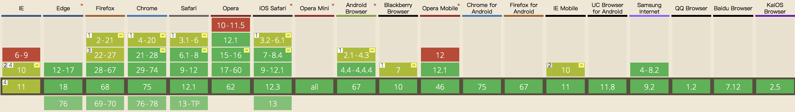

# TARO FlexBox 测试项目

## 关于 Flex 布局

2009年，**W3C** 提出了一种新的方案----Flex 布局，可以简便、完整、响应式地实现各种页面布局，且在除了 IE 之外的浏览器上都表现良好。

[](https://caniuse.com/#feat=flexbox)

> Flex 是 Flexible Box 的缩写，意为"弹性布局"，用来为盒状模型提供最大的灵活性。
> 
> 任何一个容器都可以指定为 Flex 布局。

```css
.flex-container {
  display: -webkit-flex; /* Safari */
  display: flex;
}
```

行内元素也可以使用 Flex 布局。

```css
.flex-container {
  display: -webkit-inline-flex; /* Safari */
  display: inline-flex;
}
```
